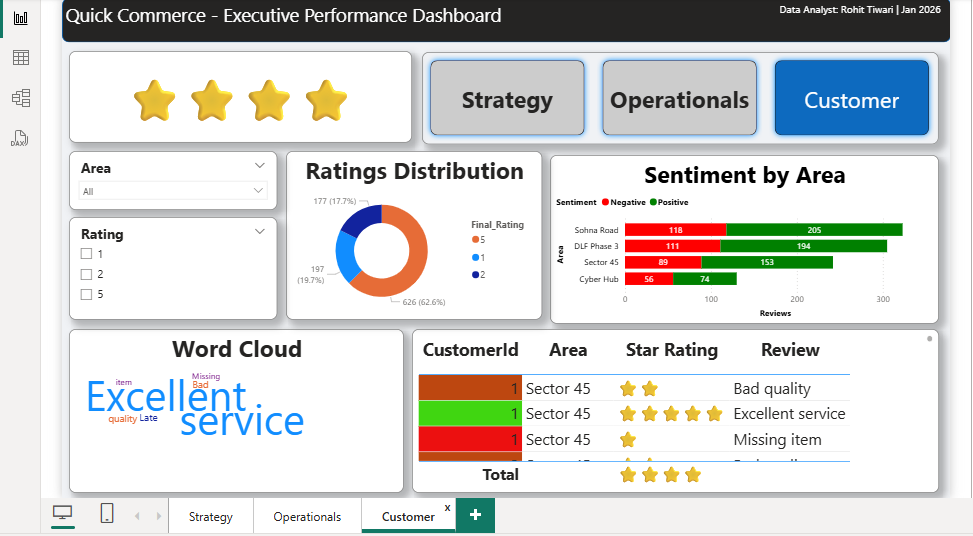
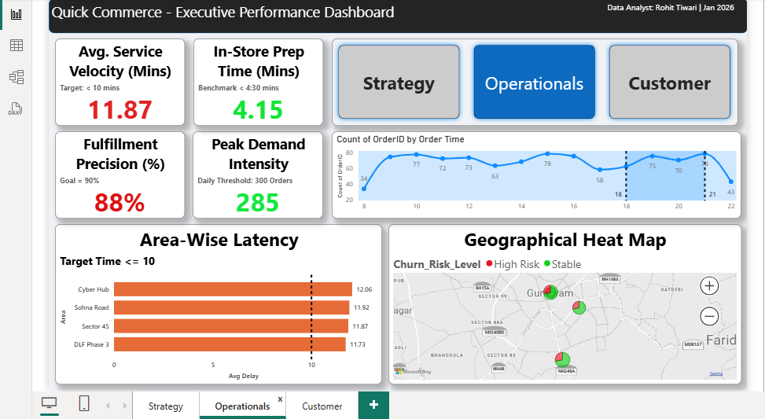
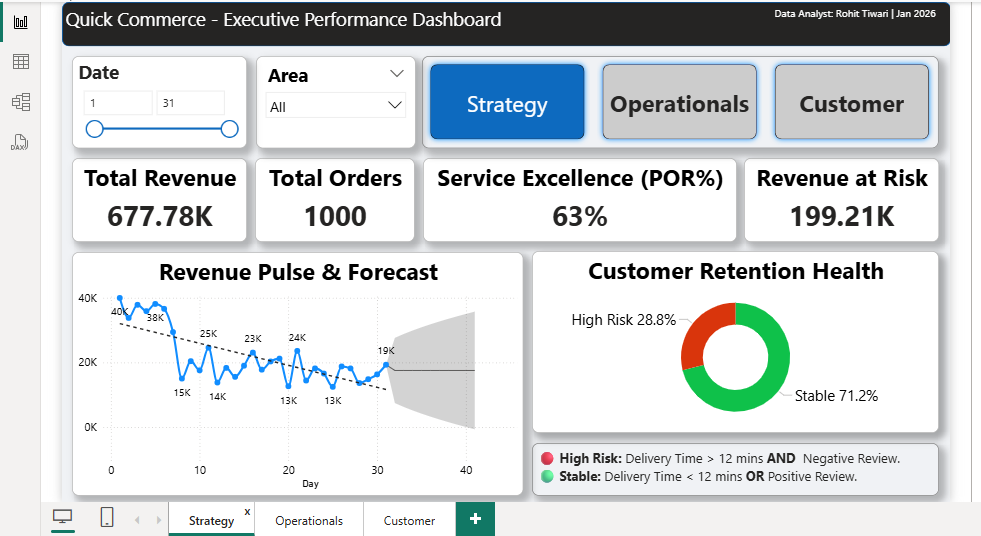

# Quick Commerce Performance Insights - Volume 1 (Minor Project) 📦📊

## Dashboard Preview

## 📌 Project Overview
This project focuses on **Descriptive Analytics** for a Quick Commerce business model (similar to Blinkit, Zepto, and Instamart). The goal was to analyze 1,000+ delivery transactions in **Gurugram** to monitor operational efficiency and customer satisfaction.

## 🚀 Key Features
- **Hyper-local Tracking:** Detailed performance analysis for specific zones like **Sector 45**, Cyber Hub, and Sohna Road.
- **Operational KPIs:** Monitoring of Average Delivery Time, Order Accuracy (POR%), and Revenue trends.
- **Customer Sentiment Analysis:** Integration of star ratings and a **Word Cloud** to identify common customer pain points.
- **Interactive Filters:** Dynamic slicers for Order Status (Delivered, Cancelled, Refunded) and Area.

## 🛠️ Tech Stack
- **Tool:** Power BI Desktop
- **Data Source:** Microsoft Excel (Cleaned & Structured)
- **Key Skills:** Data Visualization, KPI Benchmarking, Descriptive Reporting.

## 📈 Dashboard Highlights
- Identified that **Sector 45** had the highest concentration of late deliveries during evening peaks.
- Discovered a direct correlation between delivery latency and a 15% drop in average ratings.

## 📂 How to View
1. Download the `.pbix` file from this repository.
2. Open with Power BI Desktop to interact with the live dashboard.
